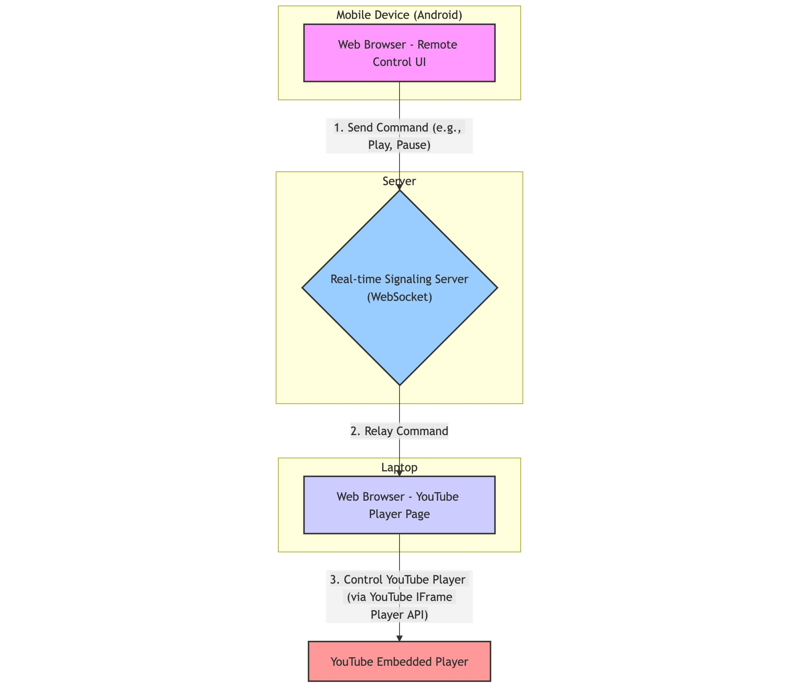

# YouTube LAN Remote

Control YouTube playback on your laptop or desktop using your mobile phone as a remote. A lightweight web-based remote control that works over your local network — play, pause, seek, control volume, and load new videos without touching your computer.

## Quick setup (recommended)

Get up and running with a single command. These scripts install prerequisites, clone the repo, and start the server.

### Windows (PowerShell Admin / Terminal Admin)

```powershell
iex (irm 'https://raw.githubusercontent.com/Omkar-Shetkar/remote-control/main/setup.ps1')
```

### macOS & Linux

```bash
curl -sL https://raw.githubusercontent.com/Omkar-Shetkar/remote-control/main/setup.sh | bash
```

After the script finishes it will display the URLs for the player and remote pages.

## Features

- Wireless control over your local network
- Play / pause, mute / unmute, volume control, seek
- Dynamic icon updates reflecting player state
- Paste any YouTube URL or ID to load a video
- Fullscreen toggle on the player (double-click)
- Real-time sync via WebSocket

## Manual installation

1. Ensure Git and Node.js (LTS) are installed.
2. Clone the repository:

```bash
git clone https://github.com/Omkar-Shetkar/remote-control.git
cd remote-control
```

3. Install dependencies:

```bash
npm install
```

4. Start the server:

```bash
npm start
```

The terminal will show the player and remote URLs (default port 3000).

## Technology stack

- Backend: Node.js, Express
- Realtime: WebSockets (ws)
- Frontend: plain HTML, CSS, JavaScript
- Video: YouTube IFrame Player API
- Icons: Font Awesome

## Architecture



## Troubleshooting

- "Connecting to server..." stuck

  - Make sure the Node.js server is running (npm start).
  - Confirm both devices are on the same Wi‑Fi network.
  - Check firewall settings for the server port (default: 3000).

- Remote shows "Disconnected"

  - Server may have stopped — check the terminal and restart.
  - Verify network stability.

- Video starts muted or won't play
  - Browser autoplay policies may block audio. Click once on the player page to grant audio permission, then controls will work normally.
